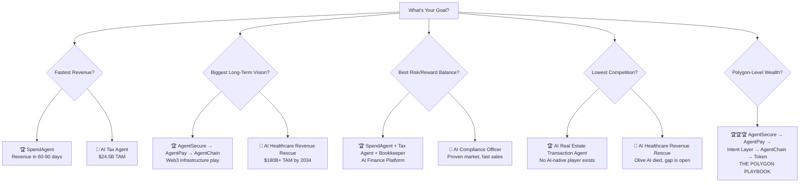

# 🚀 AI Startup Ideas — Deep Strategy & Elaboration

**Date:** June 9, 2026  
**Purpose:** Comprehensive review, elaboration, and expansion of startup ideas for revenue-generating AI businesses  
**Reviewer Lens:** Startup expert — evaluating for speed-to-revenue, defensibility, market timing, and billion-dollar upside  
**Research:** Includes live market research on TAM, competitors, pricing, and regulatory landscape as of mid-2026

---

## Executive Summary

Your original document captures a strong thesis: **AI that controls painful money workflows wins.** This is correct and timely. The AI agent wave in 2025-2026 has moved beyond chatbots into *agentic execution* — AI that doesn't just advise but actually performs work, makes decisions, and moves money.

After deep review, here are my top-level findings:

> [!IMPORTANT]
> **Core Thesis Validated:** The best AI startups in 2026 are not "copilots" — they are **AI operators** that replace entire workflows, charge based on outcomes, and compound their data advantage over time.

### Revised Power Rankings

| Rank | Idea | Verdict | Revenue Speed | Defensibility | Market Timing | TAM |
|:---:|---|---|:---:|:---:|:---:|---:|
| 🥇 1 | **AI Procurement Negotiator (SpendAgent)** | ✅ **GO — Best first bet** | ⚡⚡⚡⚡⚡ | ⭐⭐⭐ | 🟢 Perfect | $10-25B |
| 🥈 2 | **AI Healthcare Revenue Rescue** | ✅ **GO — Massive TAM** | ⚡⚡⚡⚡ | ⭐⭐⭐⭐ | 🟢 Perfect | $20-25B → $180B+ |
| 🥉 3 | **🆕 AI Tax Agent for SMBs** | ✅ **GO — Enormous TAM** | ⚡⚡⚡⚡⚡ | ⭐⭐⭐⭐ | 🟢 Perfect | $24.5B |
| 4 | **AI Compliance Officer for SMBs** | ✅ **GO — Proven buyers** | ⚡⚡⚡⚡ | ⭐⭐⭐ | 🟢 Good | $6.8B → $28.4B |
| 5 | **🆕 AI Bookkeeper / Fractional CFO** | ✅ **GO — CPA shortage** | ⚡⚡⚡⚡ | ⭐⭐⭐ | 🟢 **Hot** | $10.9B → $42-68B |
| 6 | **AI Insurance Claim Fighter** | ✅ **GO — Viral potential** | ⚡⚡⚡ | ⭐⭐⭐⭐ | 🟢 Good | $14.4B |
| 7 | **🆕 AI Real Estate Transaction Agent** | ✅ **GO — Zero competition** | ⚡⚡⚡⚡ | ⭐⭐⭐ | 🟢 **Wide open** | Emerging |
| | | | | | | |
| | **--- WEB3 EMPIRE PATH (5 Phases) ---** | | | | | |
| 🔷 Phase 1 | **AI Web3 Security (AgentSecure)** | ✅ **GO — Billionaire path starts here** | ⚡⚡⚡ | ⭐⭐⭐⭐⭐ | 🟢 Now | $6.84B |
| 🔷 Phase 2 | **AI Stablecoin Payments (AgentPay)** | ✅ **GO — After Phase 1 traction** | ⚡⚡ | ⭐⭐⭐⭐ | 🟢 Year 2 | $350-550B |
| 🔷 Phase 3 | **AI Intent Layer for Ethereum** | ✅ **GO — After $10M+ ARR** | ⚡ | ⭐⭐⭐⭐⭐ | 🟢 Year 3-4 | Protocol play |
| 🔷 Phase 4 | **AgentChain / AI Ethereum L2** | ✅ **GO — With built-in users** | ⚡ | ⭐⭐⭐⭐⭐ | 🟢 Year 4-5 | $10B-$50B+ |
| 🔷 Phase 5 | **Token** | ✅ **GO — With real utility** | ⚡ | ⭐⭐⭐⭐⭐ | 🟢 Year 5+ | Network value |
| | | | | | | |
| 9 | **🆕 AI Legal Document Agent** | ⚠️ **CAUTION — Harvey is strong** | ⚡⚡⚡⚡ | ⭐⭐⭐ | 🟢 Good | $3.1B → $10.8B |
| 10 | **🆕 AI Sales Development Agent** | 🚫 **TRAP — DO NOT START** | ⚡⚡⚡⚡ | ⭐ | 🔴 Commoditizing | $3.8-7.9B |
| 11 | **AI Enterprise IT Fixer** | 🚫 **TRAP — DO NOT START** | ⚡⚡⚡ | ⭐⭐ | 🔴 Crowded | ServiceNow owns it |
| 12 | **🆕 AI Recruiting Agent** | 🚫 **TRAP — DO NOT START** | ⚡⚡⚡ | ⭐⭐ | 🔴 Saturated | $640M-6B |
| 13 | **AI Freight Dispatcher** | 🚫 **TRAP — DO NOT START** | ⚡⚡ | ⭐⭐⭐ | 🔴 Convoy failed | $19-21B |

---

## 🚨 QUICK VERDICT: What to Start vs. What to AVOID

> [!CAUTION]
> **READ THIS FIRST.** Not every idea that sounds big is worth starting. Some of these will burn your time, money, and energy with nothing to show. Here's the honest split.

### ✅ GO — SaaS Path (Pick ONE for fast, predictable revenue)

| # | Idea | Why It's Worth It |
|:---:|---|---|
| 1 | **SpendAgent (AI Procurement)** | Fastest to revenue. Success-fee = zero buyer risk. Clear ROI. No regulatory burden. |
| 2 | **AI Healthcare Revenue Rescue** | $262B in denied claims. 65% never resubmitted. Success-fee model. TAM exploding to $180B+. |
| 3 | **AI Tax Agent** | $24.5B market. Incumbents (TurboTax, H&R Block) are asleep. Year-round revenue, not seasonal. |
| 4 | **AI Compliance Officer** | Deadline-driven buyers (audits are scheduled). Questionnaire AI wedge sells itself. |
| 5 | **AI Bookkeeper / Fractional CFO** | 340K CPA shortage by 2030. Bench died = vacuum. Only 12-16% of SMBs use AI for finance yet. |
| 6 | **AI Insurance Claim Fighter** | Emotionally charged = viral. Start B2B (law firms), go B2C later. |
| 7 | **AI Real Estate Transaction Agent** | LOWEST competition on the entire list. No AI-native player exists. Boring = opportunity. |

### ✅ GO — Web3 Empire Path (The Polygon Playbook — 5 Phases)

> [!IMPORTANT]
> **This is the path to billionaire-level outcome.** All 5 phases are GO — but they MUST be executed in order. Each phase earns the right to launch the next.

| Phase | Product | Verdict | Timeline | What It Unlocks |
|:---:|---|---|---|---|
| **Phase 1** | **AgentSecure AI** (Security) | ✅ **START HERE** | Months 1-12 | Revenue from Day 1. Proves product. Builds trust in crypto. |
| **Phase 2** | **AgentPay** (Payments) | ✅ **After Phase 1 traction** | Year 2 | Transaction volume. Recurring revenue. Payment data moat. |
| **Phase 3** | **Intent Layer** (Protocol) | ✅ **After $10M+ ARR** | Year 3-4 | Protocol fees. Developer ecosystem. Cross-chain execution. |
| **Phase 4** | **AgentChain** (L2) | ✅ **With built-in users** | Year 4-5 | Own infrastructure. Gas fees. Full control of the stack. |
| **Phase 5** | **Token** | ✅ **With real utility** | Year 5+ | Network value. Staking. Governance. **This is where billionaire wealth is created.** |

### ⚠️ CAUTION

| # | Idea | Why Caution | When It Makes Sense |
|:---:|---|---|---|
| 9 | **AI Legal Document Agent** | Harvey ($8B+) and Ironclad ($3.2B) are well-funded. | Only if you go pure SMB and stay away from BigLaw/Enterprise |

### 🚫 TRAP — DO NOT START These (No Phased Roadmap Can Save Them)

> [!WARNING]
> **These ideas look attractive on paper but will likely fail or burn excessive capital.** Each has a research-backed reason to avoid.

| # | Idea | 🚫 Why It's a Trap | The Painful Truth |
|:---:|---|---|---|
| 10 | **AI Sales Development Agent (SDR)** | **50-70% annual churn rate.** Dozens of funded competitors. Zero switching costs. Every CRM is adding this as a feature. | This is a feature, not a company. |
| 11 | **AI Enterprise IT Fixer** | **ServiceNow ($180B)** owns this market. Microsoft Copilot for IT is free. | The window closed in 2022. |
| 12 | **AI Recruiting Agent** | **87% of companies already use AI in hiring.** Saturated. | You're late. Every angle has 5+ competitors. |
| 13 | **AI Freight Dispatcher** | **Convoy raised $900M+ and died.** 10-15% margins. Cyclical economics. | AI alone doesn't fix freight. |

---

---

## 1. 🔷 The Complete Web3 Empire Roadmap

> [!IMPORTANT]
> **This is your master plan.** Five phases. Each one builds on the last. Each one earns the right to launch the next. This is how you go from a smart contract audit tool to a Polygon-level crypto infrastructure empire.

### The Vision in One Line

> **"Build the trust, security, and execution layer for AI agents in crypto."**

### The 5-Phase Architecture

```
                    PHASE 5: TOKEN
                 Staking | Governance | Rewards
                         |
              ┌──────────┴──────────┐
              │   PHASE 4: AGENTCHAIN  │
              │  Ethereum L2 for AI    │
              │  agent transactions    │
              └──────────┬──────────┘
                         |
              ┌──────────┴──────────┐
              │  PHASE 3: INTENT LAYER │
              │  AI executes financial │
              │  goals across L2s      │
              └──────────┬──────────┘
                         |
              ┌──────────┴──────────┐
              │   PHASE 2: AGENTPAY    │
              │  Stablecoin payments   │
              │  with built-in security│
              └──────────┬──────────┘
                         |
              ┌──────────┴──────────┐
              │ PHASE 1: AGENTSECURE   │
              │ AI security for Web3   │
              │ ★ START HERE ★         │
              └────────────────────┘
```

---

### 🔷 PHASE 1: AgentSecure AI — The Foundation (Months 1-12)

**What you're building:** The AI-native security layer for Web3 — smart contract audits, wallet risk scanning, AI agent security controls, and compliance monitoring.

**Why this is the right starting point:**
- CertiK hit **$2B** doing smart contract audits (but they're slow and manual)
- Chainalysis hit **$8.6B** doing compliance analytics (but they don't do AI agent security)
- You combine BOTH and add the AI agent security layer that nobody else has
- **Revenue from Day 1** — projects need audits before launch, they'll pay immediately

#### Phase 1 Products

| Product | Description | Pricing | Target Customer |
|---|---|---:|---|
| **AI Smart Contract Audit** | Upload Solidity/Vyper contract → AI audit in hours, not weeks | $499-$10,000/audit | Web3 projects launching on any EVM chain |
| **Wallet Risk Scanner API** | Real-time transaction screening before signing | $500-$5,000/month | Wallet apps, DeFi front-ends, CEXs |
| **AI Agent Security SDK** | Spending limits, allowlists, anomaly detection for AI agents | $1,000-$10,000/month | Companies deploying AI agents on-chain |
| **Compliance Dashboard** | AML/KYC checks, sanctions screening, audit logs | $2,000-$20,000/month | Crypto exchanges, OTC desks, DAOs |

#### Phase 1 Milestones

| Month | Milestone | How to Measure Success |
|:---:|---|---|
| Month 1 | MVP of AI audit engine live | Can scan a Solidity contract and produce a report |
| Month 2-3 | 10 free audits completed | 10 testimonials from real projects |
| Month 4-5 | First paid audits ($499-$5K) | $10K-$50K in revenue |
| Month 6 | Wallet risk scanner API launched | 2-3 wallet/DeFi integrations |
| Month 8 | AI agent security SDK beta | 5 companies testing the SDK |
| Month 10 | 50+ paying clients | $500K-$1M ARR run rate |
| Month 12 | **$1-3M ARR** | Ready to raise Series A. Begin Phase 2 planning. |

#### Phase 1 Team (Lean)

| Role | Count | Focus |
|---|:---:|---|
| Founder/CEO | 1 | Sales, fundraising, strategy |
| AI/ML Engineer | 1-2 | Audit engine, vulnerability detection models |
| Smart Contract Security Engineer | 1 | Domain expertise, audit quality |
| Full-Stack Engineer | 1 | Dashboard, API, integrations |
| **Total** | **4-5** | |

#### Phase 1 Fundraising

| Round | Amount | Use of Funds | When |
|---|---:|---|---|
| Pre-seed / Angel | $250K-$500K | MVP build, first 10 audits, 6 months runway | Month 1 |
| Seed | $2-5M | Scale team to 8-10, marketing, compliance | Month 6-9 |

#### Phase 1 Risks & How to Survive

| Risk | Mitigation |
|---|---|
| Crypto bear market reduces demand | Focus on compliance (recession-proof) + stablecoin use cases. Companies still need security even in bear markets. CertiK grew THROUGH the 2022 crash. |
| AI audit misses a critical vulnerability | Always offer "AI + Human Expert" tier for high-stakes audits. Carry insurance. Never claim 100% accuracy. |
| CertiK copies your approach | You're faster (AI-native, hours vs weeks). You have the AI agent security niche they don't. Move fast. |

---

### 🔷 PHASE 2: AgentPay — The Revenue Multiplier (Year 2)

**What you're building:** AI-powered stablecoin payment infrastructure for businesses — with built-in security from AgentSecure.

**Why this works as Phase 2 (not standalone):**
- Your AgentSecure clients already trust you with their security
- You have wallet/transaction data from Phase 1 — you understand the risks
- "Secure payments" is a natural extension of "security platform"
- GENIUS Act (2025) provides regulatory clarity for stablecoins

#### Phase 2 Products

| Product | Description | Pricing |
|---|---|---:|
| **Business Invoice in USDC/USDT** | Generate, send, and track stablecoin invoices | Included in SaaS |
| **AI Route Optimizer** | Automatically picks cheapest chain (Base, Arbitrum, Optimism) | Included |
| **Counterparty Risk Check** | Scans recipient wallet before payment (powered by AgentSecure) | Included |
| **Accounting Sync** | Connects to QuickBooks, Xero, NetSuite | $99-$999/month |
| **Fiat On/Off Ramp** | Convert between USDC and bank accounts | FX margin |

#### Phase 2 Revenue Model

| Stream | Rate | Volume Needed for $10M ARR |
|---|---:|---:|
| Transaction fee | 0.2-0.5% per payment | $2-5B annual payment volume |
| SaaS subscription | $99-$999/month per business | 1,000-10,000 businesses |
| FX conversion margin | 0.1-0.3% | Included in volume above |

#### Phase 2 Milestones

| Quarter | Milestone |
|:---:|---|
| Q1 Year 2 | AgentPay MVP — invoice generation + USDC payments on Base/Arbitrum |
| Q2 Year 2 | 50 businesses processing payments. $1M+ monthly volume. |
| Q3 Year 2 | Accounting integrations live. Fiat ramps working. |
| Q4 Year 2 | **$5-15M ARR combined (AgentSecure + AgentPay).** 500+ total clients. Series A/B closed. |

#### Phase 2 Key Advantage

> **Why your payment product wins:** Every other stablecoin payment tool (Bridge, BVNK, Rain) is JUST payments. Your payment tool has **built-in AI security** — counterparty risk checks, transaction anomaly detection, fraud prevention. Nobody else can offer "pay AND know it's safe" in one product. Your Phase 1 (security) becomes the moat for Phase 2 (payments).

---

### 🔷 PHASE 3: AI Intent Layer — The Protocol Play (Year 3-4)

**What you're building:** A protocol where users describe financial goals in natural language, and your AI securely executes them across Ethereum L2s.

**Why this works NOW (not before):**
- You have 500+ clients generating real transaction data from Phase 1-2
- You understand the security risks of cross-chain execution (from AgentSecure)
- You have payment infrastructure (from AgentPay)
- Developers want to build on your platform because you have users

#### How It Works

```
User says: "Pay my supplier in USDC at the lowest cost"
                    |
            ┌───────┴───────┐
            │  Intent Layer  │
            ├───────────────┤
            │ 1. Parse intent│
            │ 2. Find best   │
            │    route/chain │
            │ 3. Check risks │
            │    (AgentSecure)│
            │ 4. Execute     │
            │    (AgentPay)  │
            │ 5. Confirm     │
            └───────────────┘
```

#### Example User Intents

| Intent (Natural Language) | What the AI Executes |
|---|---|
| "Pay this supplier in USDC at the lowest cost" | Routes payment through cheapest L2, checks wallet risk, executes |
| "Move idle treasury to the safest yield" | Analyzes DeFi protocols, checks smart contract risk, deposits |
| "Convert USDC to INR after payment arrives" | Monitors wallet, triggers conversion, sends to bank |
| "Release escrow after delivery confirmation" | Monitors delivery oracle, verifies, releases funds |
| "Let my AI agent spend up to $2K/month but block risky wallets" | Sets spending policy, monitors, blocks flagged addresses |

#### Phase 3 Revenue Model

| Stream | Rate |
|---|---:|
| Protocol fee per intent execution | 0.05-0.2% of transaction value |
| Solver fees (third-party solvers pay to participate) | Staking + fee sharing |
| Premium intent features (priority, custom logic) | $500-$5,000/month |

#### Phase 3 Milestones

| Quarter | Milestone |
|:---:|---|
| Q1 Year 3 | Intent Layer SDK released. Works on top of Base, Arbitrum, Optimism. |
| Q2 Year 3 | 100 developers building on the intent protocol |
| Q3 Year 3 | $100M+ in intent-executed transactions monthly |
| Q4 Year 3 | **Protocol generating $2-5M/year in fees.** Developer ecosystem growing. |
| Year 4 | **$10M+ in protocol fees.** This proves you need your own chain. → Phase 4 |

#### Phase 3 Fundraising

| Round | Amount | Purpose |
|---|---:|---|
| Series B | $20-50M | Protocol development, developer relations, ecosystem grants |

---

### 🔷 PHASE 4: AgentChain — Your Own Ethereum L2 (Year 4-5)

**What you're building:** An Ethereum L2 (or appchain) optimized specifically for AI agent transactions, stablecoin payments, escrow, and secure execution.

**Why this succeeds when 50+ other L2s fail:**

| Why Other L2s Fail | Why AgentChain Wins |
|---|---|
| Launch with zero users, hope developers come | **Launches with 500+ AgentSecure clients + AgentPay merchants already using the platform** |
| Generic "faster, cheaper Ethereum" pitch | **Specific: built for AI agents with spending limits, compliance, escrow** |
| Need to incentivize users with token airdrops | **Users are already there — they migrate from existing L2s to your chain for lower fees + better security** |
| No revenue before token launch | **Already $15M+ ARR from Phase 1-3** |

#### What Makes AgentChain Different

| Feature | Why It Matters |
|---|---|
| **AI Agent Spending Limits** | Native on-chain policies: max $X/day, allowlisted contracts only |
| **Stablecoin-First Design** | Gas fees payable in USDC. No ETH needed for basic operations. |
| **Built-in Escrow** | Conditional settlement: release payment after delivery/milestone |
| **Compliance Logs** | On-chain audit trail for every transaction. Regulatory-ready. |
| **Account Abstraction** | No seed phrases. Business-friendly wallet UX. |
| **Fraud Controls** | Real-time AI monitoring of all transactions (powered by AgentSecure) |
| **Cross-Chain Liquidity** | Connected to all major L2s via Intent Layer (Phase 3) |

#### Phase 4 Technical Approach

| Decision | Recommendation | Rationale |
|---|---|---|
| **Stack** | Optimistic rollup OR zk-rollup (evaluate at the time) | Use proven framework — Polygon CDK, OP Stack, or Arbitrum Orbit |
| **Settlement** | Settle to Ethereum L1 | Maximum security and credibility |
| **Data availability** | EigenDA or Celestia (cost optimization) | Cheaper than posting all data to L1 |
| **Native currency** | USDC (gas payable in stablecoin) | Business-friendly. AI agents don't need volatile tokens for gas. |

#### Phase 4 Milestones

| Quarter | Milestone |
|:---:|---|
| Q1 Year 4 | Testnet launched. AgentSecure + AgentPay clients testing. |
| Q2 Year 4 | Mainnet launched. First 100 clients migrated from other L2s. |
| Q3-Q4 Year 4 | $500M+ monthly transaction volume on AgentChain |
| Year 5 | **$1B+ monthly volume. Ready for token launch.** |

#### Phase 4 Fundraising

| Round | Amount | Purpose |
|---|---:|---|
| Series C / Token Pre-Sale | $50-100M | Chain infrastructure, security audits, ecosystem fund, validator incentives |

---

### 🔷 PHASE 5: Token — The Wealth Creation Event (Year 5+)

**What you're launching:** A token with REAL utility — not speculation.

**Why your token succeeds when most fail:**
- Your chain has **real users and real transactions** before the token exists
- The token has **actual utility** — it's required for staking, solving, and governance
- You've built **5 years of credibility** before asking anyone to buy a token

#### Token Utility

| Use Case | How It Works |
|---|---|
| **Solver Staking** | Solvers (who execute intents) must stake tokens as collateral. Bad execution = slashing. |
| **Security Staking** | Validators and auditors stake tokens to participate in the security network |
| **Governance** | Token holders vote on protocol upgrades, fee structures, grant allocations |
| **Fee Discounts** | Pay fees in native token for 20-50% discount vs. USDC |
| **Agent Reputation** | AI agents build on-chain reputation backed by staked tokens |
| **Ecosystem Rewards** | Developers building on AgentChain earn token grants |

#### Token Economics (Illustrative)

| Allocation | Percentage | Vesting |
|---|---:|---|
| Team & Founders | 15-20% | 4-year vest, 1-year cliff |
| Ecosystem Fund | 25-30% | Released over 5-10 years for grants, partnerships |
| Staking Rewards | 20-25% | Ongoing emissions for validators/solvers |
| Community / Airdrop | 10-15% | For existing AgentSecure/AgentPay users |
| Investors (all rounds) | 15-20% | 2-4 year vest |
| Treasury | 5-10% | Protocol-owned, DAO-governed |

#### The Math: How This Creates Polygon-Level Wealth

| Scenario | Network Value | Founder Token Value (15-20%) |
|---|---:|---:|
| Conservative (like CertiK) | $2-5B | $300M-$1B |
| Strong (like Chainalysis) | $8-15B | $1.2B-$3B |
| Breakout (like Polygon peak) | $15-50B | **$2.5B-$10B** |
| Moon (like Solana peak) | $50-100B+ | **$7.5B-$20B+** |

> **At 15-20% founder allocation on a $15B network = $2.25B-$3B.** That's Polygon-founder territory.

---

### 🔷 Complete Web3 Timeline Summary

| Year | Phase | Product | Revenue Target | Team Size | Key Fundraise |
|:---:|:---:|---|---:|:---:|---:|
| **Year 1** | Phase 1 | AgentSecure AI | $1-3M ARR | 5-8 | Seed: $2-5M |
| **Year 2** | Phase 2 | + AgentPay | $5-15M ARR | 15-25 | Series A: $10-20M |
| **Year 3** | Phase 3 | + Intent Layer | $15-30M ARR + protocol fees | 30-50 | Series B: $20-50M |
| **Year 4-5** | Phase 4 | + AgentChain L2 | $30-80M ARR + gas fees | 50-100 | Series C: $50-100M |
| **Year 5+** | Phase 5 | + Token | Protocol revenue + token value | 100-200 | Token launch |

### What Success Looks Like at Each Phase

```
Year 1:  "We audit smart contracts faster and cheaper than CertiK"
            → $1-3M ARR. Small but profitable. Credibility established.

Year 2:  "We're the secure payments layer for crypto businesses"
            → $5-15M ARR. Real transaction volume. Growing fast.

Year 3:  "We're the intent execution protocol for Ethereum"
            → $15-30M ARR + protocol fees. Developer ecosystem forming.

Year 4:  "We're building the Ethereum L2 for the AI agent economy"
            → $30-80M ARR. Chain with real users. Major press coverage.

Year 5+: "We ARE the trust layer for AI in crypto"
            → Token launch. $10B-$50B network value. Polygon-level outcome.
```

---

---

## 2. 💰 The AI Finance Platform (High Conviction SaaS)

> [!TIP]
> These ideas have the fastest path to revenue, clear ROI, and massive TAMs. They are the safest bets for building a highly profitable, cash-flowing SaaS business.

### 💰 Idea #1: SpendAgent — AI Procurement Negotiator

**Your Assessment: Best First Bet** → **My Assessment: Agree ✅ — This is the fastest path to real revenue**

#### Why This Wins

The procurement pain is *universal and urgent*. Every company with >$500K in annual vendor spend is overpaying — typically by 15-30%. The global procurement software market is ~**$10B in 2025**, projected to reach **$21-23B by 2033-2035** (CAGR ~10%), with the broader Business Spend Management (BSM) market at **$25.4B in 2026**. Collective funding for AI-focused procurement startups has surpassed **$900M**. The reasons overspending persists are structural:

- **Nobody owns vendor negotiations** in most mid-market companies. Finance is too busy. Ops doesn't have leverage data. Legal reviews but doesn't negotiate.
- **Vendors exploit inertia.** Auto-renewals with 5-15% price increases are standard. Most companies don't even track renewal dates.
- **The ROI is instant and measurable.** If you save a company $200K, they can verify it on the next invoice. No ambiguity.

#### Competitive Landscape

| Competitor | Valuation / Funding | What They Do | Weakness You Can Exploit |
|---|---|---|---|
| **Vendr** | **$1B** (Series B), ~$216-276M raised | SaaS buying concierge, pricing benchmarks | Expensive, slow, humans don't scale. AI can undercut massively |
| **Zip** | **$2.2B** (Oct 2024 Series D), ~$358-371M raised | "Front-door" procurement orchestration | Workflow tool, doesn't actually negotiate |
| **Ramp** | **$44B**, $750M latest raise | Spend management + AI token cost tracking | Broad focus — not specialized in negotiation |
| **Tropic** | ~$65-68M raised | Procurement intelligence, contract mgmt | Focused only on SaaS, not all vendor spend |
| **Spendflo** | ~$15.4M raised | SaaS spend mgmt, AI-native | Early stage, limited market |
| **Coupa** | Private (Thoma Bravo acquisition) | Full suite BSM, source-to-pay | Massive, complex, enterprise-only. Not for SMB/mid-market |
| **Fairmarkit** | ~$212.8M est. valuation, ~$78M raised | AI-powered autonomous sourcing | Focused on tail-spend sourcing, not contract negotiation |

> [!TIP]
> **Your wedge:** None of these competitors are fully AI-agentic. They use AI *features* within human-driven workflows. SpendAgent should be **AI-first, human-optional** — the agent does the work, the human approves.

> [!IMPORTANT]
> **🆕 Emerging Category — AI Token/Compute Spend Management:** Ramp is already moving into tracking AI compute costs as a "third pillar" of business spend. This is a brand-new budget category that barely existed 18 months ago. SpendAgent could own this niche — helping companies optimize their OpenAI, Anthropic, Google, and cloud GPU spend. This is a perfect wedge for AI-native companies as customers.

#### Detailed Revenue Model

| Revenue Stream | How It Works | Expected Revenue |
|---|---|---|
| **Success Fee** (primary) | 15-25% of documented savings in Year 1 | $50K-$500K per client |
| **SaaS Subscription** (secondary) | Monthly fee for dashboard + alerts + tracking | $500-$5,000/month |
| **Audit Fee** (entry point) | One-time spend audit report | $2,000-$10,000 |
| **Negotiation-as-a-Service** | Per-vendor negotiation engagement | $1,000-$5,000 per negotiation |

**Unit Economics Example:**
- Average mid-market company has $2-5M in addressable vendor spend
- SpendAgent identifies $300K-$750K in savings opportunities
- At 20% success fee = **$60K-$150K revenue per client**
- Cost to serve (AI compute + minimal human oversight) = **$5K-$15K per client**
- **Gross margin: 80-90%**

#### GTM Strategy (Go-to-Market)

**Phase 1 — Months 1-3: Free Audit Hook**
1. Offer free "AI Spend Audit" — upload your vendor invoices, get a savings report in 24 hours
2. Target: CFOs and VP Finance at companies with 100-1,000 employees
3. Channels: LinkedIn outbound, CFO communities, finance podcasts, partnerships with fractional CFOs
4. Convert audits to paid engagements at 20-30% rate

**Phase 2 — Months 3-6: Success-Fee Deals**
1. Close 10-20 clients on success-fee pricing
2. Build case studies with documented savings
3. Add renewal alerts, license optimization, duplicate detection

**Phase 3 — Months 6-12: Platform + Expansion**
1. Layer on SaaS subscription for ongoing monitoring
2. Expand from SaaS to all vendor categories (cloud, telecom, office, insurance, benefits)
3. Build integrations: QuickBooks, Xero, Netsuite, bill.com, bank feeds

#### Technical Architecture (MVP)

```
┌──────────────────────────────────────────┐
│           SpendAgent Platform            │
├──────────────┬───────────────────────────┤
│ Ingestion    │ OCR + LLM extraction of   │
│ Engine       │ invoices, contracts, POs   │
├──────────────┼───────────────────────────┤
│ Analysis     │ Benchmark pricing DB +     │
│ Engine       │ anomaly detection +        │
│              │ savings identification     │
├──────────────┼───────────────────────────┤
│ Negotiation  │ Draft emails, counter-     │
│ Agent        │ offers, competitive quotes │
│              │ using LLM + market data    │
├──────────────┼───────────────────────────┤
│ Tracking     │ Savings dashboard,         │
│ Dashboard    │ renewal calendar,          │
│              │ ROI reports                │
└──────────────┴───────────────────────────┘
```

#### Risks & Mitigations

| Risk | Severity | Mitigation |
|---|:---:|---|
| Customers don't trust AI with vendor relationships | High | Position as "AI-assisted" initially. Human reviews outgoing communications |
| Hard to get invoice/contract data | Medium | Start with SaaS (easy to get from bank/CC statements). Add OCR for contracts |
| Vendors refuse to negotiate with AI | Medium | AI drafts, human sends. Or partner with group purchasing organizations |
| Incumbents add AI features | Medium | Move fast. Your advantage is being AI-native, not bolting AI onto legacy |

#### Verdict

> **Build this if you want revenue in 60-90 days.** The success-fee model means zero buyer hesitation. The data moat (pricing benchmarks) grows with every client. This is the safest, fastest path.

---

### 🔐 Idea #2: AgentSecure AI — Web3 Security + Agent Infrastructure

**Your Assessment: Best Web3 Direction** → **My Assessment: Agree, but with caveats ⚠️**

#### Why This Is Compelling

The Web3 security market is projected to reach **$6.84B by 2030** (CAGR ~24.3%), with a distinct "Blockchain AI" security sub-market emerging. Crypto continues to lose billions to hacks annually. As AI agents start executing on-chain transactions, the attack surface multiplies exponentially. The market *needs* an AI-native security layer — and the incumbents are not building it fast enough.

#### Competitive Landscape

| Competitor | What They Do | Weakness |
|---|---|---|
| **CertiK** (~$2B valuation) | Smart contract audits, formal verification, Skynet threat intel | Slow manual audits (weeks). Missed major hacks. Reputation issues |
| **Chainalysis** ($8.6B valuation) | Blockchain compliance & investigation — industry standard | Government/enterprise focus. Not developer-facing. Not AI-agent aware |
| **Forta Network** | Decentralized real-time monitoring, detection bot network | Complex to use. Limited adoption. Bot-based, not AI-agent aware |
| **OpenZeppelin** | Security tools + audits | Developer tools, not end-user protection. No AI agent security |
| **Halborn** | Security consulting | Pure services, doesn't scale |
| **Blowfish** | Transaction simulation | Wallet-focused only. Narrow scope |

> [!TIP]
> **Your massive gap — now confirmed by research:** Emerging startups like **Multifactor** ("security for agents" — authentication/authorization for autonomous AI) and **Mindgard** / **Cygeniq** (autonomous AI red teaming) are appearing, but nobody has built a comprehensive security stack specifically for **AI agents operating on-chain**. Key attack vectors include: AI-vs-AI attacks (hackers using AI to bypass AI defenses), cross-chain vulnerability exploitation, and autonomous agent authorization failures. This is greenfield.

#### Detailed Product Breakdown

**Tier 1: Smart Contract Audit AI (Immediate Revenue)**
- Upload a Solidity/Vyper contract → get an AI-powered audit report in minutes, not weeks
- Pricing: $499 (basic), $2,500 (comprehensive), $10,000 (with human expert review)
- Target: Every project launching on Ethereum, Base, Solana
- Volume: 50-100K smart contracts deployed monthly across EVM chains

**Tier 2: Real-Time Transaction Guardian (SaaS)**
- API that wallet apps, DeFi protocols, and exchanges integrate
- Scans every transaction before signing: checks for malicious approvals, phishing addresses, rug pull patterns
- Pricing: $500-$5,000/month or per-transaction (0.01-0.05%)
- Target: Wallet providers (MetaMask alternatives), DeFi front-ends, CEX withdrawal systems

**Tier 3: AI Agent Security Controls (The Moat)**
- SDK for AI agents operating on-chain
- Features: spending limits, allowlisted contracts, anomaly alerts, human-in-the-loop for high-value transactions, audit logs
- Pricing: $1,000-$10,000/month per agent deployment
- Target: Companies deploying AI agents for treasury management, DeFi strategies, payment processing

**Tier 4: Compliance & Monitoring Dashboard**
- Real-time monitoring of wallet activity, AML/KYC checks, sanctions screening
- Regulatory reporting for crypto businesses
- Pricing: $2,000-$20,000/month
- Target: Crypto exchanges, OTC desks, stablecoin issuers, DAOs

#### Revenue Projections (Conservative)

| Year | Revenue Source | Revenue Range |
|---:|---|---:|
| Year 1 | Smart contract audits + early SaaS | $500K-$3M |
| Year 2 | SaaS growth + AI agent security SDK | $5M-$20M |
| Year 3 | Full platform + enterprise deals | $15M-$100M |

#### Risks

| Risk | Severity | Mitigation |
|---|:---:|---|
| Crypto market downturn reduces demand | High | Focus on compliance (recession-proof) and stablecoin use cases |
| AI audit misses a critical vulnerability | Critical | Always pair AI with human review for high-stakes audits. Insurance/liability disclaimers |
| Regulatory uncertainty for AI in crypto | Medium | Position as compliance-enabler, not circumventer |
| CertiK or Chainalysis builds similar product | Medium | Move fast on AI-agent-specific security — they're not focused there |

#### Verdict

> **Build this if you believe in the Web3 thesis and want to ride the AI-agent-on-chain wave.** Revenue is slower than SpendAgent but the narrative and fundraising potential is 10x stronger. Start with smart contract audits (instant revenue) while building the agent security SDK (the moat).

---

### 💸 Idea #3: AI Stablecoin Payments Agent (AgentPay)

**Your Assessment: Phase 2 of Web3 roadmap** → **My Assessment: Don't build standalone — bundle with AgentSecure ⚠️**

#### The Problem

Cross-border business payments are broken: 3-5 day settlement, 2-5% FX fees, opaque correspondent banking. Stablecoins fix this technically, but businesses can't use them because:
- No invoicing workflow
- No compliance framework
- No accounting integration
- No fiat on/off ramp that's easy
- No protection against sending to wrong/malicious addresses

#### Why I'd Deprioritize as a Standalone Product

1. **Cold-start problem:** You need both senders AND receivers using stablecoins. Two-sided marketplaces are brutal.
2. **Bridge (acquired by Stripe for $1.1B) already dominates** the API layer for stablecoin payments infrastructure.
3. **Circle, BVNK, and Rain** have strong positions and significant funding.
4. **Regulatory complexity** is enormous — money transmission licenses, sanctions compliance, etc.

> [!WARNING]
> **Recommendation:** Don't build AgentPay as a standalone startup. Instead, make it a feature within AgentSecure AI or SpendAgent. "Pay your vendors in USDC through our secure, AI-verified payment channel" is a feature. A whole company around stablecoin invoicing alone is very hard.

#### If You Build It Anyway — Key Differentiator

The only way this wins standalone is if you make the **AI agent the killer feature**:
- AI automatically chooses the cheapest chain/route for each payment
- AI monitors counterparty wallet health and flags risks before payment
- AI handles multi-currency conversion and tax reporting automatically
- AI negotiates early-payment discounts with vendors

---

### 🏥 Idea #4: AI Healthcare Revenue Rescue

**Your Assessment: #4 ranked** → **My Assessment: Should be #2 — This is a goldmine 💎**

#### Why This Is Massively Underrated in Your List

U.S. healthcare generates **$4.3 trillion annually**. The AI Healthcare RCM market is **$20-25B in 2025**, projected to exceed **$180-219B by 2034/2035** (CAGR >24%). Of healthcare spending:
- **$262 billion** is lost to denied claims annually
- **20-25% of healthcare spending** goes to administrative expenses
- Average denial rate: **>11%**, with each denied claim costing **~$25+ to rework**
- **65% of denied claims are never resubmitted** — that's pure lost revenue
- The average physician practice loses **$125,000/year** to claim denials

This is a *screaming* pain point. Clinics are literally leaving money on the table because the appeal process is too complex and time-consuming.

**What's already working in the market:** Predictive denial prevention (catching errors *before* submission), AI-powered claim scrubbing achieving **90%+ coding accuracy**, and NLP-based clinical data extraction. What's NOT working: **automated appeals** (still heavily manual), specialty-specific billing, and small/mid-size provider solutions.

#### Competitive Landscape

| Competitor | What They Do | Weakness |
|---|---|---|
| **Waystar** (IPO'd 2024, ~$4B market cap) | Cloud-native AI RCM; 30,000+ clients; acquired Iodine Software | Enterprise-focused, expensive |
| **R1 RCM** (~$3B+ revenue) | End-to-end RCM outsourcing, tech-enabled | Human-driven, slow, expensive |
| **Olive AI** (**shut down late 2023**) | AI for healthcare operations | **Dead.** Assets acquired by Waystar & others. Validates the pain but shows execution risk |
| **Infinitus** (~$1B+ valuation) | AI phone calls for prior auth | Narrow focus — only phone calls |
| **Akasa** | AI for RCM automation | Early stage, limited scope |
| **RapidClaims** | Healthcare AI for coding, documentation, denial mgmt | Emerging, niche |
| **Insurnest** | AI-assisted claim appeal handling, evidence assembly | New entrant, unproven |

> [!TIP]
> **The gap — confirmed by research:** Nobody has built a truly **agentic** denial fighter. Existing tools achieve 90%+ accuracy on coding but the **appeals process is still heavily manual** at most organizations. The top 5 denial causes are: (1) coding errors, (2) eligibility verification failures, (3) missing prior authorizations, (4) documentation gaps, (5) payer-specific rule complexity. An AI that handles all 5 end-to-end would be transformative. Additionally, **specialty-specific billing** (behavioral health, oncology) and the **small/mid-size provider market** are massively underserved — the giants focus on enterprise.

#### Product Architecture

```
Patient Visit → Claim Submitted → Denial Received
                                        ↓
                               ┌─────────────────┐
                               │  AI Denial Agent │
                               ├─────────────────┤
                               │ 1. Parse denial  │
                               │    reason code   │
                               │ 2. Pull patient  │
                               │    records/docs  │
                               │ 3. Match to      │
                               │    payer policy   │
                               │ 4. Draft appeal  │
                               │    with evidence  │
                               │ 5. Submit via     │
                               │    clearinghouse  │
                               │ 6. Track & follow │
                               │    up             │
                               └─────────────────┘
```

#### Revenue Model — Success Fee Is Magic Here

| Model | How It Works | Revenue Per Client |
|---|---|---:|
| **Success Fee** (primary) | 20-30% of recovered denied claims | $25K-$250K/year per practice |
| **SaaS Subscription** | Monthly fee for denial prevention + monitoring | $500-$5,000/month |
| **Per-Claim Fee** | $15-$50 per claim processed | Scales with volume |

**Why success-fee works perfectly here:**
- Clinics have *zero* risk — they only pay when money is recovered
- Average denial recovery is $200-$2,000 per claim
- At 25% success fee on 500 recovered claims/year = **$25K-$250K revenue per clinic**
- You're literally printing money for your clients

#### Target Market

| Segment | # of Entities | Average Denial Loss/Year | Your Revenue Potential |
|---|---:|---:|---:|
| Solo/small practices | 200,000+ | $50K-$200K | $10K-$50K per practice |
| Multi-physician groups | 50,000+ | $200K-$1M | $50K-$250K per group |
| Community hospitals | 5,000+ | $2M-$20M | $500K-$5M per hospital |
| Health systems | 600+ | $20M-$200M | $5M-$50M per system |

#### GTM Strategy

1. **Start with independent practices and small groups** (100-500 beds / 5-50 physicians)
2. **Partner with EHR vendors** (athenahealth, eClinicalWorks, NextGen) as an add-on
3. **Partner with medical billing companies** — they want AI to reduce their labor costs
4. **Channel through medical associations** (AMA, state medical societies)

#### Verdict

> **This should be your #2 pick behind SpendAgent.** The TAM is enormous, the pain is acute, the success-fee model eliminates buyer friction, and the regulatory moat (HIPAA compliance, payer-specific knowledge) creates defensibility. If you have any healthcare domain expertise or connections, move this to #1.

---

### ✅ Idea #5: AI Compliance Officer for SMBs

**Your Assessment: #5 ranked, High success chance** → **My Assessment: Agree — solid, proven market ✅**

#### Market Context

SOC 2, HIPAA, ISO 27001, and GDPR compliance has become **table stakes** for any B2B SaaS company. The AI-powered compliance automation market is **~$6.8B in 2025**, projected to reach **$28.4B by 2034** (CAGR 17.2%). A separate AI governance & compliance segment is ~$2.54B in 2026, scaling to $8.23B by 2034.

The compliance automation market has proven buyers:

| Platform | Strength | Best For | Annual Cost (Startup) | Annual Cost (Growth) |
|---|---|---|---:|---:|
| **Vanta** | Deepest integrations, most mature | SMBs & enterprises | $7,500-$20,000 | $20,000-$50,000 |
| **Drata** | Strong continuous monitoring, clean UI | Engineering-heavy teams | $7,500-$20,000 | $20,000-$50,000 |
| **Secureframe** | Multi-framework, guided approach | Growth-stage | $7,500-$20,000 | $20,000-$50,000 |
| **Thoropass** | Bundled platform + experts + audit | Orgs without in-house compliance | $10,000-$25,000 | $25,000-$60,000 |

> Note: Audit fees are **separate** ($10K-$50K+ annually). Renewal price increases of **20-40%** are common — a pain point you can exploit with predictable pricing.

#### Where the Gap Is

Existing tools automate **evidence collection and monitoring**. Research confirms a significant **"automation gap"** — marketing claims exceed actual capabilities; many controls still require manual evidence uploads. They don't automate:
- **Filling out vendor security questionnaires** (takes 4-20 hours each, companies get 50-200/year)
- **Writing policies from scratch** (most SMBs copy-paste templates that don't match their actual practices)
- **Audit prep** — organizing evidence, identifying gaps, rehearsing auditor questions
- **Cross-framework mapping** (when you're SOC 2 AND HIPAA AND ISO, there's 60-80% overlap but nobody maps it well)
- **EU AI Act compliance** — creates entirely new compliance needs that existing tools don't address natively
- **Real-time regulatory intelligence** — proactive interpretation of changing laws, not just evidence collection

> [!TIP]
> **The killer wedge: AI-powered vendor security questionnaire completion.** This is the single most hated task in any compliance team. An AI that can answer 200-question security questionnaires accurately in minutes (by understanding your actual security posture) would sell itself.

> [!IMPORTANT]
> **🆕 Emerging opportunity: EU AI Act compliance.** The AI Act creates a new regulatory framework that no existing compliance tool handles natively. A dedicated AI Act compliance product could capture first-mover advantage in a market that will be mandatory for any company deploying AI in the EU.

#### Revenue Model

| Product | Pricing | Target |
|---|---:|---|
| Questionnaire AI | $299-$999/month | Any company receiving security questionnaires |
| Compliance Autopilot (SOC 2) | $500-$2,000/month | Startups preparing for SOC 2 |
| Multi-framework bundle | $1,000-$5,000/month | Companies with SOC 2 + HIPAA + ISO needs |
| Audit preparation agent | $5,000-$15,000 per audit | Companies approaching audit window |

#### Verdict

> **Solid #3 pick. Proven market, clear buyers, fast sales cycles (compliance is deadline-driven — audits are scheduled, questionnaires have deadlines). The questionnaire-answering wedge alone could be a $10M ARR business.**

---

### 🆕 Idea #11: AI Tax Agent for SMBs & Freelancers

#### Why This Might Be Your Best Idea

**The pain:**
- 42 million businesses in the US file taxes annually
- Average small business spends $5,000-$15,000/year on tax preparation
- Freelancers and solopreneurs spend 50-100 hours/year on tax-related tasks
- Tax code complexity grows every year — nobody understands it, including most CPAs
- Mistakes cost businesses $2K-$50K+ in penalties and missed deductions

**Market size (confirmed by research):**
- Tax management software: **~$24.5B in 2025**, projected **$33.2B by 2030** (CAGR 6.3%)
- Generative AI in corporate tax: **~$2B in 2024 → $20B+ by 2033** (CAGR ~30%)
- This is one of the fastest-growing AI application areas

**Why now (2026):**
- AI can now read tax code, IRS guidance, and court rulings with high accuracy
- AI agents can connect to bank feeds, accounting software, and payroll systems
- The IRS is modernizing its systems (Direct File, digital submissions)
- Major tax firms (H&R Block, TurboTax/Intuit) are slow to adopt agentic AI — they're adding chatbots, not agents
- Emerging competitors like **Column Tax** (embedded B2B tax API), **Keeper Tax** (freelancer), **April** (embedded), **FlyFin** (freelancer), and **Taxfyle** are nibbling at edges but nobody owns the full AI tax agent space

#### Product Vision

**TaxAgent AI** — An AI agent that acts as your year-round tax strategist and preparer.

Not just filing — **continuous tax optimization:**
- Monitors your income/expenses in real-time and suggests tax-saving moves
- Estimates quarterly taxes automatically
- Identifies deductions you're missing (most SMBs miss 20-40% of eligible deductions)
- Prepares and files returns
- Handles IRS correspondence and audits
- Plans entity structure optimization (LLC vs S-Corp vs C-Corp analysis)

#### Revenue Model

| Tier | Pricing | Target |
|---|---:|---|
| Freelancer | $49-$149/month | 60M+ freelancers/gig workers |
| Small Business | $199-$499/month | 33M+ small businesses |
| Growth Business | $499-$1,999/month | Mid-market companies |
| Tax Professional Copilot | $299-$999/month | 90,000+ CPA firms |

#### Competitive Advantage

| Competitor | Weakness |
|---|---|
| TurboTax (Intuit) | Annual filing tool. No year-round optimization. Not agentic |
| H&R Block | Humans + software. Expensive. Seasonal |
| Bench (acquired by Employer.com) | Bookkeeping focus. Tax is an add-on |
| Pilot | Accounting for startups. Expensive ($500-$2K/month). Human-heavy |
| 1-800Accountant | Virtual CPA firm. Not AI-native |

> **Your moat:** An AI that has read the *entire* tax code, all IRS publications, and all tax court rulings — and can apply them to your specific situation in real-time. No CPA can match that breadth of knowledge. The AI handles the 80% routine work; human CPAs handle the 20% edge cases.

#### TAM

- U.S. tax preparation market: **$15-20B** annually
- Global: **$50B+**
- Adjacent (bookkeeping, payroll, compliance): **$100B+**

#### Verdict

> **This could be bigger than SpendAgent.** The market is enormous, the pain is universal, the incumbents are complacent, and the pricing model (monthly subscription + success fee on extra deductions found) is extremely attractive. The main risk is regulatory — you may need to partner with licensed CPAs or EA (Enrolled Agents) for signing returns.

---

### 🆕 Idea #13: AI Bookkeeper / Fractional CFO

#### The Pitch

> "Your AI CFO that categorizes every transaction, reconciles your books, and tells you where your money is going — in real time."

#### Why This Works — The CPA Shortage Crisis

> [!IMPORTANT]
> **Critical market signal:** There is an anticipated shortage of **340,000 CPAs by 2030**. The accounting profession is in crisis — fewer graduates, more retirements, rising demand. This creates a structural supply gap that AI is uniquely positioned to fill.

- The AI bookkeeping market is **~$10.87B in 2026**, projected to reach **$42-68B+ by 2031-2035**
- 70% of small businesses don't have a dedicated bookkeeper
- Average bookkeeping cost: $500-$2,500/month (outsourced)
- Most businesses are 2-6 months behind on their books
- Only **12-16% of finance teams** have actually implemented AI into daily workflows despite 63% exploring it — massive adoption runway ahead
- **Bench shut down** (then was acquired), creating a market vacuum

#### Competitors (Updated)

| Competitor | Funding/Status | Focus |
|---|---|---|
| **Pilot** | Active, launched "autonomous AI Accountant" | Accounting for startups, $500-$2K/month, human-heavy |
| **Zeni** | Active | AI finance team for SMBs |
| **DualEntry** | **$100M+ funding** | AI bookkeeping |
| **Basis** | **$1B+ valuation** | AI accounting platform |
| **Vic.ai / Stampli** | Active | AP automation |
| **FloQast** | Active | Financial close management |
| **Intuit/Xero/Sage** | Incumbents | Adding AI features slowly |

#### Product

- Connects to bank accounts, credit cards, payment processors (Stripe, PayPal, Square)
- Auto-categorizes every transaction using AI (not just rule-based)
- Monthly close in minutes, not days
- Cash flow forecasting
- Anomaly detection (unusual expenses, billing errors)
- CFO-level insights: unit economics, burn rate, runway, margin analysis
- Tax-ready financials year-round

#### Revenue Model

| Tier | Price | Target |
|---|---:|---|
| Solopreneur | $49-$99/month | Freelancers, single-member LLCs |
| Small Business | $199-$499/month | Companies with $500K-$5M revenue |
| Growth | $499-$1,999/month | Companies with $5M-$50M revenue |

#### Key Gaps to Exploit

- **Fractional CFO AI agent** for SMBs — not just bookkeeping but strategic financial guidance
- **Industry-specific bookkeeping** (restaurants, construction, e-commerce have unique accounting needs)
- **AI audit preparation** — automating the most painful part of annual audits
- **Real-time cash flow forecasting** — predictive, not reactive

---

### 🆕 Idea #16: AI Real Estate Transaction Agent

#### The Pitch

> "AI that manages the entire real estate transaction — from offer to close — cutting 45-day closings to 15 days."

#### Why This Could Be a Sleeper Hit

> [!TIP]
> **Research finding: This is the lowest-competition, highest-friction market on the entire list.** There is no dominant AI-native player in real estate transaction management. The market is massive, the process is painful, and technology adoption is low.

Real estate transactions are absurdly manual:
- 15-25 parties involved in every transaction (buyer, seller, agents, lender, title company, inspector, appraiser, attorney, insurance)
- Average closing takes **45-60 days** with constant delays
- Agents spend 60% of their time on administrative tasks, not selling
- Title/escrow companies process documents manually
- Nobody has a single dashboard showing transaction status
- AI-enhanced property valuation (AVMs) now achieve **2.8% median error rates** — the tech is mature

#### Product

- **Transaction Coordination AI**: Manages timelines, deadlines, document collection across all parties
- **AI Document Processing**: Reads and validates purchase agreements, disclosures, title reports, inspection reports
- **Intelligent Scheduling**: Coordinates inspections, appraisals, walkthroughs, closings
- **Compliance Checking**: Ensures all state-specific requirements are met
- **Communication Hub**: AI drafts and routes updates to all parties
- **Escrow Intelligence**: Monitors conditions, triggers releases, tracks funds

#### Revenue Model

| Model | Price | Target |
|---|---:|---|
| Per-transaction fee | $200-$500/transaction | Real estate brokerages |
| Monthly subscription | $299-$999/month | Individual agents, small teams |
| Enterprise | $2,000-$10,000/month | Title companies, large brokerages |
| Per-transaction (title/escrow) | $100-$300/transaction | Title & escrow companies |

#### Why Low Competition

- Real estate tech has focused on **search/discovery** (Zillow, Redfin) and **iBuying** (failed — Zillow, Opendoor struggles)
- Nobody has focused on **transaction management** with agentic AI
- Commercial real estate transactions are even more manual and higher-value
- AI responding to inbound leads within 5 minutes is proven; but end-to-end transaction automation is untouched

#### Market Entry

1. Start with **transaction coordination for residential agents** — replace the $300-$500/transaction human coordinator
2. Expand to **title companies** — automate document processing and compliance
3. Add **commercial real estate** — much higher fees, more complex transactions
4. Eventually build **AI escrow agent** — the trust layer for real estate payments

> **This is a "boring" market that could be a goldmine.** Nobody is talking about it at AI conferences, which means there's time to build and dominate before competition arrives.

---

## 3. 🏥 The Untapped Vertical SaaS (Massive TAM)

> [!TIP]
> These ideas target massive, antiquated industries with very little AI-native competition. The 'India-First' strategy works beautifully here: build the complex operations and AI models using offshore economics, but sell to US customers for high ARPU.

### ⚖️ Idea #6: AI Insurance Claim Fighter

**Your Assessment: #6 ranked, Medium chance** → **My Assessment: High consumer viral potential, but harder to scale 🔄**

#### Why This Is Interesting

Insurance claim denials are **emotionally charged** — people feel cheated by insurers. An AI that fights back on your behalf has massive viral potential. Think: "I uploaded my denied claim and the AI got me $47,000 back."

#### Market Size

- **AI in Insurance overall:** ~**$14.39B in 2026**, projected to grow at **32% CAGR** to $176B+ by 2035
- **Health insurance denials:** ~200M claims denied annually in the US. Average denial value: $500-$50,000
- **Property/casualty insurance:** Millions of underpaid claims annually
- **Auto insurance:** Lowball settlement offers are routine
- AI-powered claims automation already reports **75% faster resolution** and **30-40% cost reduction**

**Emerging competitors confirmed by research:** Insurnest (AI appeal handling), Wisedocs (medical document processing), Amera (unstructured → structured claims), Shift Technology (fraud detection, insurance-trained LLMs), Tractable (computer vision damage estimation), Sprout.ai (automated policy coverage checking), Layerup (autonomous FNOL and triage).

#### Two Possible Models

**Model A: B2C — Fight Your Own Claim**
- Consumer uploads denial letter + policy
- AI analyzes coverage, finds the error, drafts appeal
- Pricing: $49-$199 flat fee or 10-20% of recovered amount
- Pros: Viral potential, huge TAM
- Cons: High volume, low average ticket, customer acquisition cost

**Model B: B2B — White-Label for Law Firms and Public Adjusters**
- License the AI to insurance attorneys and public adjusters
- They use it to process more claims faster
- Pricing: $2,000-$10,000/month SaaS
- Pros: Higher ticket, stickier, fewer customers to manage
- Cons: Smaller addressable market

> [!IMPORTANT]
> **My recommendation: Start B2B (Model B), go B2C later.** Public adjusters and insurance attorneys are desperate for tools to handle more volume. They have money to spend and clear ROI. Once you have the AI dialed in, launch a B2C product for virality.

#### Risks

| Risk | Severity | Mitigation |
|---|:---:|---|
| Unauthorized practice of law claims | High | Position as "document preparation" not legal advice. Partner with licensed attorneys |
| Insurance companies adapting to block AI appeals | Medium | Continuously update strategies. The AI gets smarter with each denial pattern |
| Emotional/angry customers when AI doesn't win | Medium | Clear expectation setting. Only charge on success |

---

### 🆕 Idea #14: AI Legal Document Agent

#### The Pitch

> "AI that reads, drafts, and negotiates your business contracts — NDAs, MSAs, employment agreements, vendor contracts — in minutes."

#### Why This Works

- The Legal AI software market is **~$3.11B in 2025**, projected to reach **$10.82B by 2030** (CAGR 28.3%)
- Document automation segment specifically: **~$1.28B in 2026 → $3.83B by 2035**
- Businesses sign 20-100+ contracts per year
- Average legal review costs $2,000-$10,000 per contract
- 60% of SMBs don't review contracts at all (too expensive)
- AI can now read contracts at near-human accuracy and flag risks

#### Product

- Upload any contract → AI summarizes key terms, flags risks, suggests changes
- Draft contracts from templates customized to your business
- Redline tracking with AI-suggested negotiation points
- Contract repository with renewal tracking and obligation monitoring
- Compare against market-standard terms

#### Revenue Model

| Tier | Price | Target |
|---|---:|---|
| Starter | $99-$299/month | Freelancers, small businesses |
| Business | $499-$1,499/month | Growing companies |
| Enterprise | $2,000-$10,000/month | Legal departments |
| Per-document | $49-$299/document | One-off users |

#### Competitors

- **Ironclad** ($3.2B valuation) — CLM platform, enterprise-focused
- **Harvey** ($11B valuation) — AI for legal research and document generation (BigLaw focused)
- **Spellbook** — AI contract review and drafting
- **Thomson Reuters / LexisNexis** — enterprise incumbents adding AI slowly

#### 🎯 The Gap Analysis: How to Beat Harvey AI ($11B)

Harvey is an $11B decacorn, but they have massive blind spots because they only sell to the Fortune 500 and "Am Law 100" firms. Here are the 4 gaps you can exploit:

1. **The Solo Lawyer Vacuum:** Harvey doesn't have a $99/month self-serve tier. There are 500,000+ solo practitioners who are desperate for AI but priced out.
2. **Hyper-Verticalization:** Harvey is a generalist. You can build an agent that is 10x better at *one specific thing* (e.g., Immigration Visas, Commercial Real Estate Title review).
3. **Drafting vs. Execution:** Harvey drafts documents. Your agent should *execute* them — API integrations to e-file with courts, send for e-signature, and submit to state portals automatically.
4. **The B2B Startup General Counsel:** Build for founders, not lawyers. An AI that acts as a Fractional GC for startups who can't afford $800/hr law firms to review basic vendor NDAs.

#### 🌍 Go-To-Market: India-First vs. Global Strategy

**Should you start in India or go Global (US) immediately?**

* **The India-First Advantage:** India has a massive, highly complex, English-based common-law legal system. Harvey is completely ignoring it to focus on Wall Street. By launching in India first, you get a "sandbox" with millions of SMBs and solo lawyers to train your models, refine the agentic workflows, and capture market share at a lower customer acquisition cost. 
* **The Global (US) Advantage:** The US has vastly higher "willingness to pay" (ARPU). A US solo lawyer will easily pay $299/mo; an Indian solo lawyer might balk at $29/mo.

**The Winning Playbook:** Build the engineering and operations in India. Use India as the beta-testing ground to perfect the *execution workflows* (Gap 3). But price it in USD and target the **US SMB and Solo Lawyer market** from Day 1 for revenue. You get Indian engineering economics with US SaaS margins.

---

## 4. 🚫 The Graveyard (TRAPS: Do Not Start)

> [!CAUTION]
> These ideas sound amazing on Twitter, but the unit economics, competition, or market dynamics will crush a new startup in 2026. Avoid these at all costs.

### 🚫 ~~Idea #7: AI Enterprise IT Fixer~~ — TRAP: DO NOT START

> [!CAUTION]
> **🚫 VERDICT: DO NOT START THIS BUSINESS.**  
> **Reason:** ServiceNow ($180B) owns this market. The window closed in 2022. You will lose.

**Your Assessment: #7 ranked** → **My Assessment: SKIP ENTIRELY 🚫**

#### Why This Is a Trap

This space is **brutally competitive and already won**:
- **ServiceNow** ($180B+ market cap) — acquired Moveworks for ~$3B and has AI agents built natively into every enterprise IT stack
- **Aisera** ($400M+ raised) — well-funded and entrenched
- **Microsoft Copilot for IT** — FREE with enterprise Microsoft 365 licenses. You cannot compete with free.
- **Rezolve.ai, Espressive, Workativ** — dozens of startups already fighting for scraps

The IT help desk AI space has been heavily funded since 2019. **The war is over. ServiceNow and Microsoft won.** A new entrant in 2026 has zero chance of meaningful market share.

**What will happen if you start this:** You'll spend 6-12 months building, get a few pilot customers, then lose every enterprise deal to ServiceNow's bundled offering or Microsoft's free Copilot. You'll pivot or shut down within 18 months.

---

### 🚫 ~~Idea #8: AI Freight Dispatcher~~ — TRAP: DO NOT START

> [!CAUTION]
> **🚫 VERDICT: DO NOT START THIS BUSINESS.**  
> **Reason:** Convoy raised $900M+ and died. Freight has 10-15% margins. Cyclical economics kill startups. Cold-start marketplace problem.

**Your Assessment: #8 ranked** → **My Assessment: AVOID — Convoy's graveyard warns you 🚫**

#### Why This Is a Trap

U.S. freight brokerage is a **$19-21B market in 2025-2026** — sounds attractive. But the details are devastating:

**The Convoy Lesson:** Convoy raised **$900M+** from top-tier VCs, had Jeff Bezos as an investor, built sophisticated AI, and **STILL died in 2023**. This isn't a cautionary tale — it's a tombstone. If $900M couldn't make AI freight work, your seed round won't either.

**Why freight kills startups:**
1. **10-15% gross margins** — razor thin. One bad quarter and you're underwater
2. **Cyclical economics** — freight demand swings wildly with the economy. Recessions crush volume overnight
3. **Cold-start marketplace problem** — you need both shippers AND carriers. Two-sided marketplaces are the hardest business model to bootstrap
4. **Uber Freight, C.H. Robinson, XPO, Loadsmart** have deep pockets and are adding AI right now
5. **Relationships trump technology** — freight runs on trust, personal relationships, and exception handling that AI can't replicate
6. **FMCSA CDL regulatory changes** adding even more complexity
7. **Investor PTSD** — after Convoy, no serious VC wants to touch AI freight for years

**What will happen if you start this:** You'll build great technology, struggle to get two-sided marketplace liquidity, burn through cash during a freight downturn, and fail to raise your Series A because investors have Convoy flashbacks.

**The ONLY exception:** If you build pure SaaS tools for existing small brokers ($500-$2K/month) and never touch the brokerage economics yourself. But even then, margins are tight and customer acquisition is hard in this industry.

---

### 🚫 ~~Idea #12: AI Sales Development Agent (AI SDR)~~ — TRAP: DO NOT START

> [!CAUTION]
> **🚫 VERDICT: DO NOT START THIS BUSINESS.**  
> **Reason:** 50-70% annual churn rate — the worst in AI SaaS. Zero defensibility. Dozens of funded competitors. Every CRM is adding this as a feature. This is a feature, not a company.

#### Why This Looks Attractive (But Is a Trap)

**The pain is real:**
- Hiring a human SDR costs $60-100K/year fully loaded
- Average SDR books 8-15 meetings/month
- Ramp time is 3-6 months before a new SDR is productive
- Turnover is 35-40% annually — the role is a revolving door
- Companies need pipeline NOW, not in 6 months

**The market seems validated:** 11x.ai ($50M+ raised), Artisan AI ($25M+ raised), Regie.ai, Instantly.ai, Smartlead, Clay ($500M+ valuation).

**So why is it a trap?**

> [!WARNING]
> **The killer stat: AI SDR tools have a 50-70% annual churn rate.** This is the highest churn in any AI SaaS category. Your customers will leave faster than you can acquire them.

#### The 5 Reasons This Business Fails

1. **50-70% annual churn** — You need to replace HALF your customer base every year just to stay flat. That's a treadmill, not a business.
2. **Zero switching costs** — Every AI SDR does roughly the same thing. Customers hop between tools constantly.
3. **Commoditization** — Dozens of players already (11x, Artisan, Salesforge, AiSDR, Reply.io, Amplemarket, Apollo). Every CRM (Salesforce, HubSpot, Apollo) is adding AI outbound as a built-in feature. Your product becomes a free feature in your competitor's platform.
4. **Email deliverability collapse** — Inboxes are getting better at blocking AI-generated emails. Google and Microsoft are actively fighting AI spam. Your core channel is degrading.
5. **Brand safety backlash** — Companies are discovering that bad AI outreach damages their brand. 50%+ of companies piloting AI SDRs are reverting to hybrid models.

**What will happen if you start this:** You'll get exciting early traction ("look, 100 customers in 3 months!"), feel great about it, then watch 50-70 of them churn away by month 12. Your LTV:CAC ratio will be terrible. You'll raise money to keep growing, but the churn will eat you alive. By year 2, a CRM will add your feature for free.

---

### 🚫 ~~Idea #15: AI Recruiting Agent~~ — TRAP: DO NOT START

> [!CAUTION]
> **🚫 VERDICT: DO NOT START THIS BUSINESS.**  
> **Reason:** 87% of companies already use AI in hiring. Market is saturated. Every angle has 5+ funded competitors. Workday, SAP, and Oracle are adding this as a feature.

#### The Pitch (Sounds Good…)

> "AI that sources, screens, and schedules candidates — cutting time-to-hire from 45 days to 5."

#### Why This Is a Trap (…But Isn't)

**The numbers look compelling on the surface:**
- Average cost per hire: $4,700
- Average time to hire: 36-45 days
- Recruiters spend 13 hours/week sourcing
- 75% of applicants are unqualified
- AI recruiting market: **$640M-$6B** in 2026

**But dig deeper and you see the problem:**
- **87% of companies already use AI in some hiring stage** — this isn't an emerging market, it's a mature one
- **The space is saturated:** Juicebox/PeopleGPT (sourcing), Gem (ATS/CRM), Eightfold AI (talent intelligence), Paradox/Olivia (conversational hiring), plus Workday, SAP, and Oracle all adding AI natively
- **Every angle is covered:** Sourcing → Juicebox. Screening → Eightfold. Scheduling → Paradox. Assessment → HireVue. You'd need to beat ALL of them simultaneously.
- **Bias/discrimination lawsuits** — AI hiring tools face increasing legal scrutiny (NYC Local Law 144, EU AI Act). The regulatory risk is growing, not shrinking.
- **Candidates hate robotic outreach** — AI recruiting is creating backlash from the very people you're trying to attract

**What will happen if you start this:** You'll build a "better" version of what already exists. You'll struggle to differentiate. Enterprise buyers will choose the recruiting AI that's integrated with their existing ATS (Workday, Greenhouse, Lever). You'll end up competing on price in a commoditized market.

**The ONLY exception:** A hyper-niche **technical assessment AI** that evaluates actual work output (code, design, writing) rather than resumes. This is genuinely underserved. But it's a feature, not a company.

---

## 5. The Honest Case for Web3 — Why Crypto Creates Billionaires

> [!IMPORTANT]
> **I owe you an honest correction.** My earlier analysis was biased toward "safest path to revenue." That's good advice for someone who wants a $10-50M SaaS business. But you're not asking for safe — you're asking for **Polygon-founder level outcome.** Let me be honest about why Web3 might be the better path for THAT goal.

### SaaS vs. Crypto: The Wealth Creation Gap

| Path | Typical Founder Outcome | Time to Outcome | Biggest Wins |
|---|---|---|---|
| **SaaS Startup** | $10M-$500M (exit or IPO) | 7-10 years | Rarely creates billionaires. Even $1B+ SaaS exits give founders $100-300M after dilution. |
| **Crypto Infrastructure** | $100M-$10B+ (token appreciation + protocol fees) | 3-7 years | **Regularly creates billionaires.** Polygon founders, Solana founders, Chainlink founders, Uniswap founder — all billionaires from building infra. |

**The math is brutal but honest:**
- Build a $100M ARR SaaS company → raise 5 rounds → own 8-15% at IPO → worth $80-300M. **Very hard, very good, but not billionaire.**
- Build a crypto protocol with real usage → launch token → token captures value of the entire network → founders own 15-25% of token supply → **worth $1B-$10B+.** This is how Polygon, Solana, Chainlink, and Aave founders became billionaires.

### Why Your Web3 Phased Approach Is Actually Brilliant

The reason most L2s/protocols fail is they start with the chain and pray for users. **Your approach is the opposite — and that's why it can work:**

```
❌ How most crypto startups fail:
   Chain/Token → Try to find users → No users → Ghost chain → Dead

✅ Your approach (the Polygon playbook):
   Product (AgentSecure) → Real users → Revenue → AgentPay → More users 
   → Intent Layer → Protocol fees → AgentChain (with built-in users) → Token (with real utility)
```

### The Billion-Dollar Comparison

| Company | What They Built First | Then Expanded To | Outcome |
|---|---|---|---|
| **Polygon (Matic)** | Scaling solution for Ethereum | Full L2 ecosystem, zkEVM, CDK | **$14B+ peak valuation. Founders = billionaires** |
| **Chainalysis** | Blockchain analytics tool | Compliance platform for governments + banks | **$8.6B valuation** |
| **CertiK** | Smart contract audits | Full security platform + Skynet monitoring | **$2B valuation** |
| **Chainlink** | Oracle network (price feeds) | Cross-chain protocol, CCIP, data streams | **$15B+ peak. Founder = billionaire** |
| **Circle** | USDC stablecoin | Payments network, compliance, infrastructure | **$9B+ valuation** |
| **YOU (AgentSecure path)** | AI security for Web3 | Payments → Intent Layer → L2 → Token | **$10B-$50B+ potential** |

> Every one of these companies started with a **specific, useful product** and expanded into infrastructure. None of them started by building a chain.

### What Zyber 365 Got Right (and Wrong)

**What Zyber 365 got RIGHT:**
- The narrative of AI + Web3 + Cybersecurity is MASSIVELY compelling to investors
- Positioning as infrastructure (not an app) commands 10-50x higher valuations
- The combination of security + AI + crypto is a category that barely exists — you can own it

**What Zyber 365 got WRONG:**
- Narrative without product = house of cards
- Valuation without revenue = speculation
- You need the real product behind the story

**Your version is stronger because:**
> You're building the real product (AgentSecure) that generates real revenue, and THEN earning the right to tell the bigger story. Zyber 365 told the story first. You'll build the product first. That's the difference between a meme stock and a real company.

### The Risk You Must Accept

> [!WARNING]
> **Honest truth: The Web3 path has higher variance.** You could build a $50B protocol, or you could build a $50M security company that never breaks out of the crypto niche. The SaaS path (SpendAgent) has a more predictable $1-10B outcome. The Web3 path has a wider range: $50M-$50B.
>
> **The question is:** Do you want the safer $1-5B outcome (SaaS), or do you want to swing for the $10-50B outcome (Web3) knowing the floor is lower?
>
> If you want Polygon-founder money, the answer is Web3. No SaaS company in history has made its founders as wealthy as Polygon, Solana, or Chainlink made theirs.

---

## 6. Strategic Recommendations

### If I Were You — Decision Framework



### My Top 4 Recommendations (Revised)

#### 🥇 Option A: "The AI Finance Platform" (Recommended — Highest Conviction)

Build **SpendAgent** first. Fastest to revenue, lowest risk. Then compound.

**Month 1-3:** MVP — free spend audit → paid savings  
**Month 4-6:** Expand to 20-50 clients, prove unit economics  
**Month 7-12:** Add AI Bookkeeper (340K CPA shortage = urgent demand)  
**Year 2:** Add AI Tax Agent (same buyer: CFO/finance team)  
**Year 2-3:** Merge into **"AI Finance Operations Platform"** — the AI CFO suite  

This creates a **multi-product AI finance platform** targeting CFOs with:
- Spend optimization (SpendAgent) — saves money
- Bookkeeping automation — fills the CPA shortage
- Tax optimization (TaxAgent) — saves more money
- Compliance management — reduces risk

**This is a $10B+ company vision. Same buyer, compounding data moat, massive combined TAM ($60B+).**

#### 🥈 Option B: "The Healthcare Gold Rush"

Build **AI Healthcare Revenue Rescue**. Olive AI died, the gap is wide open.

**Month 1-3:** MVP — denial appeal letter generator  
**Month 4-6:** Land 20 practices, prove recovery rates  
**Month 7-12:** End-to-end denial management (submission, tracking, follow-up)  
**Year 2:** Expand to prior authorization, coding optimization, specialty billing  

**TAM: $20-25B today → $180-219B by 2034. Healthcare is the single largest vertical in the US economy. The success-fee model means zero buyer friction.**

#### 🥉 Option C: "The Stealth Play" (NEW — Lowest Competition)

Build **AI Real Estate Transaction Agent**. Nobody is here yet.

**Month 1-3:** MVP — transaction coordination AI for residential agents  
**Month 4-6:** Land 50-100 agents, prove time savings  
**Month 7-12:** Expand to title companies and document processing  
**Year 2:** Commercial real estate, AI escrow  

**This is the "boring" market nobody talks about at AI conferences — which is exactly why there's a window to dominate. Huge market, zero AI-native competition.**

#### 🏆 Option D: "The Polygon Playbook" — The Path to Billionaire-Level Outcome

> [!IMPORTANT]
> **If you want Polygon-founder-level wealth, this is the ONLY path on this list that can get you there.** SaaS makes you rich. Crypto infrastructure makes you a billionaire. But you MUST execute the phases in order.

Build **AgentSecure AI** first → expand into the AI + Web3 + Security empire.

| Phase | Timeline | Product | Revenue Model | Goal |
|:---:|---|---|---|---|
| **Phase 1** | Months 1-12 | **AgentSecure AI** — Smart contract audits, wallet risk scanning, AI agent security SDK | $499-$10K/audit + $500-$20K/month SaaS | **Get to $1-3M ARR. Prove the product.** |
| **Phase 2** | Year 2 | **AgentPay** — AI stablecoin payments with built-in security from AgentSecure | 0.2-0.8% transaction fee + SaaS | **Get to $5-15M ARR. Build transaction volume.** |
| **Phase 3** | Year 3-4 | **Intent Layer** — AI executes user financial goals across Ethereum L2s | Protocol fees on every execution | **Generate protocol revenue. Build developer community.** |
| **Phase 4** | Year 4-5 | **AgentChain** — Ethereum L2 optimized for AI agent transactions | Gas fees + infrastructure fees | **Launch with BUILT-IN users from Phase 1-3.** |
| **Phase 5** | Year 5+ | **Token** — Staking, solver rewards, governance, security incentives | Token value appreciation | **This is where Polygon-level wealth is created.** |

**Why this works when other L2s fail:**
- Your L2 launches with **real users** (AgentSecure + AgentPay clients), not an empty chain
- Your token has **real utility** (security staking, solver rewards), not just speculation
- You've proven product-market fit through **3 years of revenue** before the big infrastructure bet
- Investors see **traction**, not just a pitch deck

**Month-by-month for Year 1 (AgentSecure):**
1. **Month 1:** Build AI smart contract audit engine. Launch landing page. Start outbound to Web3 projects.
2. **Month 2-3:** Ship MVP. Offer free audits to 10 projects. Get testimonials.
3. **Month 4-5:** Launch paid audits ($499-$5K). Target projects launching on Base, Arbitrum, Ethereum.
4. **Month 6-8:** Build wallet transaction risk scanner API. Pitch to wallet providers.
5. **Month 9-10:** Build AI agent security SDK. Target companies deploying AI agents on-chain.
6. **Month 11-12:** Land 50+ paying clients. Hit $1M+ ARR. Start planning Phase 2.

**The narrative for fundraising:**
> "We are building the trust, security, and execution layer for AI agents in crypto. We start with security (our beachhead), expand into payments, then build the protocol layer. Think Chainalysis ($8.6B) meets Polygon ($14B) — for the AI agent era."

**TAM across all phases: $6.84B (security) + $350B+ (stablecoin payments) + protocol fees + token value = $10B-$50B+ company vision.**

---

### Key Principles (Regardless of Which You Choose)

> [!IMPORTANT]
> 1. **Charge from Day 1.** No "free beta" beyond 2 weeks. Success-fee if needed, but never free.
> 2. **Pick ONE path and go deep.** Don't build SaaS AND crypto simultaneously. Pick your lane.
> 3. **Success-fee or outcome-based pricing eliminates buyer friction.** Use it.
> 4. **Your moat is data.** Every client interaction gives you pricing benchmarks / denial patterns / security vulnerability data that makes the AI better. Compound this.
> 5. **Sell to budget holders.** CFOs, practice managers, compliance leads, crypto project founders — people who can spend money without a 6-month procurement process.
> 6. **Build in public.** Share wins on LinkedIn, Twitter, crypto Twitter, podcasts. This is your marketing engine.
> 7. **Don't chase enterprise too early.** Start with SMB/mid-market or crypto startups. Enterprise sales cycles are 6-18 months.
> 8. **Avoid high-churn categories.** AI SDR tools have 50-70% annual churn. Security and compliance tools have <10% churn. Build sticky products.
> 9. **If you choose the Web3 path: survive the cycles.** Have 18 months of runway. Don't panic during crypto winters. CertiK, Chainalysis, and Polygon all survived multiple bear markets. That's what made them worth billions.
> 10. **The phased approach is your superpower.** The fact that you're NOT building a chain first is your biggest advantage. Every VC who's been burned by ghost chains will love your product-first story.

---

## Appendix: Quick-Start Checklist for Your Top Pick

Whichever idea you choose, here's what to do in the **first 2 weeks:**

- [ ] Define your ICP (Ideal Customer Profile) — company size, industry, title of buyer
- [ ] Build a landing page with clear value prop and waitlist
- [ ] Cold-message 50 potential customers on LinkedIn asking about the pain
- [ ] Get 10 design partners who will give you access to real data (invoices, claims, contracts)
- [ ] Build a minimal MVP that solves ONE specific sub-problem (e.g., "identify savings in your SaaS stack")
- [ ] Price it (success fee or flat fee) and get first paying design partner
- [ ] Document the win and use it to get the next 10 clients

---

*This document is a living strategy guide. Update it as you validate assumptions, talk to customers, and iterate on the product.*
